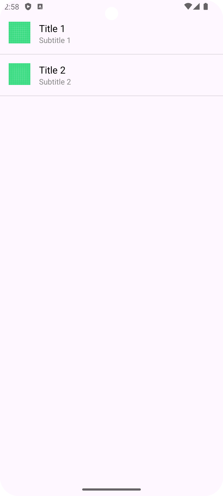

# Custom List View in Android

This guide provides a step-by-step approach to creating a custom ListView in Android. Follow these steps to implement a custom ListView using a custom adapter and layout.

## Steps to Create a Custom ListView

### 1. Create the Custom Layout File for the list item 

Design a custom layout for the list items. This layout defines how each item should appear in the ListView. You will typically create an XML file that specifies the layout structure, including any views such as ImageViews and TextViews.

[**`list_item.xml`**](./app/src/main/res/layout/list_item.xml)

### 2. Add a parent to hold all the list items

Add a ListView to your activity’s layout XML file. This ListView will serve as the container for displaying all your list items. Make sure to specify its width and height, and provide it with an id so you can reference it in your activity code.

[**`activity_main.xml`**](./app/src/main/res/layout/activity_main.xml)

### 3. Implement the Custom Adapter

Develop a custom adapter to bind your data model to the ListView. The adapter is responsible for inflating the custom layout and populating it with data from the data model. It handles the display and recycling of list items.

[**`MyAdapter.kt`**](./app/src/main/java/com/example/mylistpractice/MyAdapter.kt)

### 4. Use the Adapter in Your Activity

In your activity, first create and populate a data source using your data class. Next, instantiate your custom adapter with this data source and set it to the ListView. This will link your data with the ListView and display the items using the custom layout.

[**`MainActivity.kt`**](./app/src/main/java/com/example/mylistpractice/MainActivity.kt)

### 5. (OPTIONAL) define click listner

If you want to handle item clicks in the ListView, set an OnItemClickListener for the ListView in your activity. This listener allows you to perform actions based on user interactions with individual list items, such as navigating to a new screen or showing a detailed view.

[**`MainActivity.kt`**](./app/src/main/java/com/example/mylistpractice/MainActivity.kt)

### AND ALL SET!!!

You have successfully created a custom ListView in your Android application. This powerful component allows you to efficiently display and interact with a vertical list of items, providing a smooth and intuitive way to present and navigate through your data.