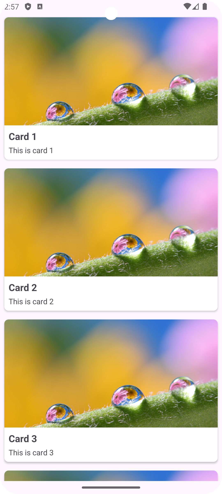

# Custom CardView in Android



This guide provides a step-by-step approach to creating a custom CardView in Android. Follow these steps to implement a custom CardView using a custom adapter and layout.

In this guide, we will not focus much on how to create a RecyclerView. For that, you can refer to [**`RecyclerView`**](../3.RecyclerViewPractice/README.md).

## Steps to Create a Custom CardView

### 1. Create the Custom Layout File for the CardView

Design a custom layout for the CardView items. This layout defines how each card should appear in the RecyclerView. Typically, you'll create an XML file that specifies the layout structure, including views like `ImageView`, `TextView`, and `CardView`.

[**`card_item.xml`**](app/src/main/res/layout/custom_card_view.xml)

### 2. Create a Data Class for Defining the Structure for CardItem

Create a data class that defines the structure of your card item. This class will include properties like the title, description, and image resource ID, which will be used to populate each CardView.

[**`CardItem.kt`**](app/src/main/java/com/example/mycardview/MainActivity.kt)

```kotlin
data class CardItem(
    val image: Int,
    val title: String,
    val description: String
)
```

### 3. Edit `build.gradle.kts (Module :app)` to Turn on View Binding

To enable View Binding in your project, you'll need to edit your module-level `build.gradle` file. Add the following line inside the `android` block:

[**`build.gradle.kts (Module :app)`**](app/build.gradle.kts)

```kotlin
android {
    ...
    buildFeatures {
        viewBinding = true
    }
}
```
**Remember to `sync` the gradle file** 

After enabling View Binding, sync your project with Gradle files. This will generate binding classes for each XML layout file, allowing you to interact with views in a type-safe manner.

It will be helpful to use `viewBinding` as in cards, usually we will be storing multiple views to enhance the look and feel of the card.

### 4. Implement RecyclerView

Implement the RecyclerView in your activity by setting up a layout manager and linking it to your custom adapter. The RecyclerView will serve as the container for your CardView items.

[**`MyCardAdapter.kt`**](app/src/main/java/com/example/mycardview/RecyclerViewUtils.kt)

[**`MainActivity.kt`**](app/src/main/java/com/example/mycardview/MainActivity.kt)

For detailed guide on creating [**`RecyclerView`**](../3.RecyclerViewPractice/README.md) click here

### AND ALL SET!!!

You have successfully created a custom CardView in your Android application. This component allows you to efficiently display and interact with a list of cards, offering a visually appealing and organized way to present your data.