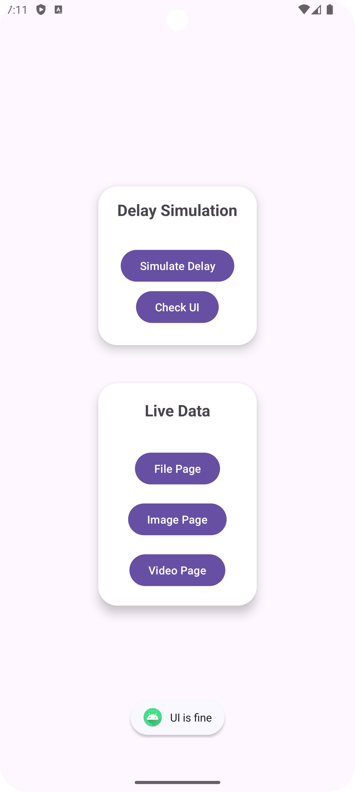
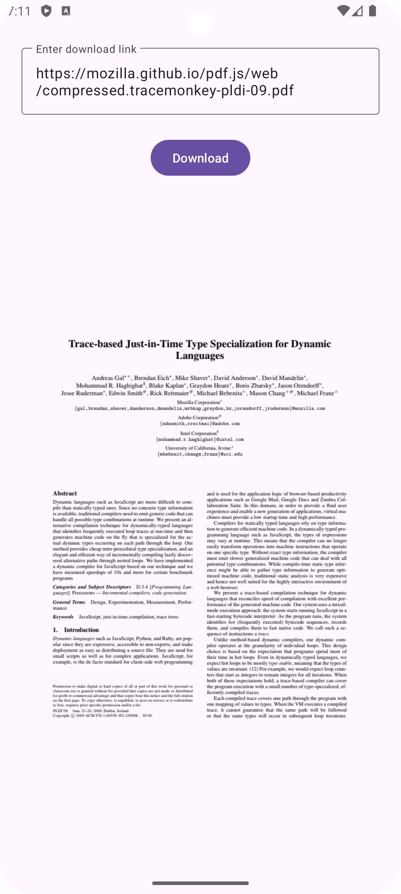

# Understanding Kotlin Coroutines and File Downloading in Android





## What Happens Without Coroutines?

### UI Freezing and the Main Thread

In Android, the main thread (or UI thread) handles all user interface updates. If you run a long task, such as downloading data or processing information, directly on this thread, it blocks the UI from updating, leading to freezing or lagging. This makes the app unresponsive, creating a poor user experience.

### Experience the Difference: Smooth vs. Laggy UI Updates

- **Check UI Button:** When you click this button, you'll see an immediate ripple effect and a `Toast` message, confirming that the UI is responsive and updates instantly.
- **Simulate Delay Button:** After clicking this button, try clicking the `Check UI` button. You'll notice that the ripple effect and `Toast` message won't appear until the delay is complete. This demonstrates how the UI freezes when a long task blocks the main thread.

[**`Main Activity`**](./app/src/main/res/layout/activity_main.xml) click here to view implmentation

### Looper and Handler

Before coroutines, Android developers relied on `Looper` and `Handler` to manage background tasks without blocking the main thread:

- **Looper:** This class processes messages from a queue, managing UI events on the main thread. While each thread can have its own `Looper`, the main thread's `Looper` is special as it handles all UI-related tasks.
- **Handler:** This class posts messages or runnables to a thread's message queue. It allows background tasks to run on separate threads, with the results posted back to the main thread for UI updates.

### Challenges Without Coroutines

- **Complexity:** Managing multiple threads with `Looper` and `Handler` can be complicated, especially as your app grows in size and complexity.
- **Boilerplate Code:** Thread management requires a lot of code, making your app harder to develop and maintain.
- **Error-Prone:** Manual thread handling can lead to bugs like race conditions, deadlocks, and memory leaks, which are difficult to diagnose and fix.

Coroutines simplify these challenges by offering a straightforward way to run long tasks in the background without blocking the main thread, keeping your UI smooth and responsive.

## What Are Coroutines?

Kotlin coroutines simplify asynchronous programming by letting you write code that looks synchronous but runs in the background. This allows you to perform long tasks without freezing the UI and without the hassle of manual thread management.

### Core Concepts of Coroutines:

1. **Suspending Functions**:

   - Suspending functions allow you to perform long-running tasks without blocking the thread. They can pause execution and resume later, freeing up the thread for other work.

   ```kotlin
   suspend fun fetchData(): String {
       delay(1000) // Simulate network delay
       return "Data fetched"
   }
   ```

2. **Coroutine Scope**:

   - A scope defines the lifecycle of coroutines. In Android, you can tie a scope to the lifecycle of an activity or fragment, ensuring that all coroutines are canceled when the component is destroyed.

   ```kotlin
   class MainActivity : AppCompatActivity() {
       private val scope = MainScope()

       override fun onDestroy() {
           super.onDestroy()
           scope.cancel() // Cancel coroutines when the activity is destroyed
       }
   }
   ```
### **Types of Coroutine Scopes**

- **`GlobalScope`**:
    - **Definition**: A global, application-wide scope.
    - **Usage**: Suitable for tasks that should persist across the entire application lifecycle, but not recommended for tasks tied to specific activities or fragments due to potential issues with lifecycle management.
    
- **`lifecycleScope`** (Activity Scope):
    - **Definition**: Scoped to the lifecycle of an `Activity`. Automatically manages coroutine cancellation based on the activity's lifecycle events.
    - **Usage**: Ideal for tasks that should be canceled when the activity is destroyed, ensuring proper resource management.

- **`viewLifecycleOwner.lifecycleScope`** (Fragment Scope):
    - **Definition**: Scoped to the lifecycle of a fragment's view. Automatically manages coroutine cancellation when the fragment's view is destroyed.
    - **Usage**: Best for tasks related to fragment views, ensuring proper lifecycle management.

- **`viewModelScope`** (ViewModel Scope):
    - **Definition**: Scoped to the lifecycle of a `ViewModel`. Automatically manages coroutine cancellation when the `ViewModel` is cleared.
    - **Usage**: Useful for tasks that should be canceled when the `ViewModel` is no longer needed, allowing tasks to continue across configuration changes.
    
- **`CoroutineScope`** (Custom Scope):
    - **Definition**: A custom coroutine scope that you create and manage manually. It is not tied directly to the lifecycle of an activity, fragment, or ViewModel.
    - **Usage**: Provides flexibility for managing coroutines with a custom lifecycle or in scenarios where predefined scopes are not suitable.

3. **Coroutine Context**:

   - Coroutine context determines where and how the coroutine runs. Dispatchers like `Dispatchers.Main` and `Dispatchers.IO` control whether the coroutine runs on the main thread or a background thread.

   ```kotlin
   scope.launch(Dispatchers.IO) {
       // Code here runs on the IO dispatcher, suitable for network or database operations
   }
   ```

- **Types of Coroutine Context**

    In Kotlin coroutines, `Dispatchers` are used to define the thread or thread pool on which coroutines run. Here are the main types of dispatchers:
    
    - **`Dispatchers.Main`**: Runs coroutines on the main thread (UI thread) of the application.
    
    - **`Dispatchers.IO`**: Optimized for offloading blocking I/O tasks, such as reading from or writing to files, performing network operations, or interacting with databases.
    
    - **`Dispatchers.Default`**: Designed for CPU-intensive tasks and computational work. It uses a shared pool of threads optimized for such tasks.
    
    - **`Dispatchers.Unconfined`**: Starts coroutines in the caller thread but may switch to other threads as needed. It does not confine coroutines to any specific thread.
    
    Each dispatcher is designed to handle specific types of tasks and provides different thread management strategies to optimize performance and resource usage.
    
4. **Structured Concurrency**:

   - Structured concurrency ensures that coroutines are launched within a specific scope. If the scope is canceled, all child coroutines are canceled as well, preventing memory leaks and ensuring that your app remains efficient.

   ```kotlin
   scope.launch {
       coroutineScope { // Creates a new scope
           launch {
               // Child coroutine
           }
       }
   }
   ```

## Why Use Coroutines in Android?

Coroutines allow you to perform long-running tasks like downloading files without blocking the main thread, which keeps the UI responsive and enhances the user experience. Additionally, coroutines are lightweight compared to threads. They use less memory and resources, enabling you to handle many concurrent operations efficiently without the overhead associated with managing multiple threads.

With coroutines, the download runs on a background thread, keeping the UI responsive.

## How Coroutines Work

### 1. Launching Coroutines

Coroutines are launched within a scope. For instance, in an Android activity, you might use `MainScope`, which is tied to the activity’s lifecycle.

```kotlin
scope.launch {
    // Coroutine code here
}
```

### 2. Suspending and Resuming

Coroutines can suspend their execution at a given point and resume later. This is particularly useful for operations like network requests or file downloads.

```kotlin
suspend fun downloadFile(url: String): ByteArray {
    val result = withContext(Dispatchers.IO) {
        URL(url).readBytes() // Runs on IO dispatcher
    }
    return result
}
```

### 3. Switching Contexts

Coroutines make it easy to switch between different threads or dispatchers within the same block of code.

```kotlin
CoroutineScope(Dispatchers.Main).launch {
    val data = withContext(Dispatchers.IO) {
        fetchDataFromNetwork() // Runs on IO dispatcher
    }
    updateUI(data) // Runs on the Main dispatcher
}
```

### 4. Handling Errors

Handling errors in coroutines is straightforward. You can use `try-catch` blocks within coroutines just as you would in regular synchronous code.

```kotlin
scope.launch {
    try {
        val data = fetchData()
        updateUI(data)
    } catch (e: Exception) {
        handleError(e)
    }
}
```

## Tutorial: Using Coroutines to Download and Display Files in Android

### Step 1: Setting Up the Project

Start by creating a new Android project, adding the necessary permissions, and setting up your UI.

- **Add Permissions**:

  ```xml
  <uses-permission android:name="android.permission.INTERNET"/>
  ```

- **Set Up UI**:
  In your layout file, add views like `ImageView` for images, `VideoView` for videos, and a button to trigger the downloads.

### Step 2: Using Coroutine Scope and Context

Define a coroutine scope in your activity and use it to launch coroutines. For downloading files, use `Dispatchers.IO` to ensure that the operation runs on a background thread.

```kotlin
scope.launch(Dispatchers.IO) {
    // Download file in the background
}
```

### Step 3: Performing Asynchronous Downloads

Download files such as PDFs, images, or videos using coroutines. Each download operation should run on an I/O dispatcher to avoid blocking the main thread.

```kotlin
scope.launch(Dispatchers.IO) {
    val url = URL("https://example.com/sample.pdf")
    val input = url.openStream()
    val outputFile = File(filesDir, "sample.pdf")
    outputFile.outputStream().use { fileOut ->
        input.copyTo(fileOut)
    }
}
```

### Step 4: Updating the UI After Download

Once a file is downloaded, switch back to the main thread to update the UI.

```kotlin
withContext(Dispatchers.Main) {
    // Update ImageView, VideoView, or notify the user
}
```

### Step 5: Managing Coroutine Lifecycle

Ensure that your coroutines are tied to the lifecycle of your Android components. For example, cancel any running coroutines when the activity or fragment is destroyed.

```kotlin
override fun onDestroy() {
    super.onDestroy()
    scope.cancel() // Cancels all coroutines when the activity is destroyed
}
```
## Example using Coroutines for Handling Real-Life Problems

### Step 1: Ask for Internet Permission

To perform network operations such as downloading files, images, or videos, your app needs to request permission to access the internet. Follow these steps to add the required permission:

1. **Open the `AndroidManifest.xml` file**: This file is located in the `src/main` directory of your Android project.[**`AndroidManifest.xml`**](./app/src/main/AndroidManifest.xml)

2. **Add the Internet Permission**: Insert the following line within the `<manifest>` tag to request internet access:

    ```xml
    <uses-permission android:name="android.permission.INTERNET" />
    ```

    This line declares that your app requires access to the internet, which is necessary for network requests.

3. **Sync Your Project**: Ensure that your project syncs with these changes by clicking "Sync Now" in Android Studio if prompted.

With this permission in place, your app can now perform network operations, including downloading files, images, and videos using coroutines.

### Step 2: Add Dependency for HTTP Requests

To perform HTTP requests, you'll need to add the appropriate dependencies to your project. For this example, we use Ktor for making network requests. Follow these steps:

1. **Open the `build.gradle.kts` file**: This file is located in the `app` module of your project. [**`build.gradle.kts`**](./app/build.gradle.kts)

2. **Add Ktor Dependencies**: Add the following lines under the `dependencies` block to include the Ktor client libraries:

    ```groovy
    // Ktor client core dependency
    implementation "io.ktor:ktor-client-core:2.3.12"

    // Ktor client for Android dependency
    implementation "io.ktor:ktor-client-android:2.3.12"
    ```

    These dependencies allow you to use Ktor's HTTP client for making network requests in your Android app.

3. **Sync Your Project**: Click "Sync Now" in Android Studio to download and integrate the new dependencies into your project.

With these dependencies added, you can use Ktor to handle HTTP requests efficiently in your app, leveraging coroutines for asynchronous operations.

### If your `build.gradle` looks something like this
```kotlin
    implementation(libs.androidx.core.ktx)
    implementation(libs.androidx.appcompat)
    implementation(libs.material)
    implementation(libs.androidx.activity)
    implementation(libs.androidx.constraintlayout)
    testImplementation(libs.junit)
    androidTestImplementation(libs.androidx.junit)
    androidTestImplementation(libs.androidx.espresso.core)
```

Then to handle HTTP requests in your app using Ktor, you'll need to add the appropriate dependencies. Here's how to do it using TOML for dependency management:

1. **Open the `libs.versions.toml` File**: This file is usually located in the `gradle` directory. [**`libs.versions.toml`**](./gradle/libs.versions.toml)

2. **Add Ktor Dependencies in `libs.versions.toml`**:
   
   Ensure the following entries are included in the `libs.versions.toml` file:

    ```toml
    [versions]
    ...
    ktorCore = "2.3.12"
    ktorAndroid = "2.3.12"

    [libraries]
    ...
    ktor-client-core = { group = "io.ktor", name = "ktor-client-core", version.ref = "ktorCore" }
    ktor-client-android = { group = "io.ktor", name = "ktor-client-android", version.ref = "ktorAndroid" }
    ```

3. **Reference Dependencies in `build.gradle.kts`**:

    In your `build.gradle.kts` file, include the Ktor dependencies using the `libs` reference: [**`build.gradle.kts`**](./app/build.gradle.kts)

    ```kotlin
    dependencies {
        implementation(libs.ktor.client.core)
        implementation(libs.ktor.client.android)
    }
    ```

4. **Sync Your Project**: Click "Sync Now" in Android Studio to apply these changes and download the necessary libraries.

By adding these dependencies, your app will be able to perform HTTP requests using Ktor, leveraging Kotlin coroutines for asynchronous operations.

### Benefits of Using Ktor

**Ktor** is a lightweight and efficient HTTP client library that works seamlessly with Kotlin coroutines. Its benefits include:

- **Lightweight**: Ktor is designed to be minimalistic, making it suitable for simple HTTP requests.
- **Coroutines Support**: It integrates well with Kotlin coroutines, allowing for non-blocking network operations and easy concurrency management.

### Recommendations for Complex Applications

For more complex applications that require advanced features and robust networking capabilities, consider using:

- **Retrofit**: Offers a higher-level API for RESTful web services and integrates with various data converters and error handling.
- **OkHttp**: Provides a powerful HTTP client with advanced features like connection pooling, caching, and support for HTTP/2.

While Ktor is great for simpler use cases due to its lightweight nature and coroutine support, Retrofit and OkHttp offer more comprehensive solutions for complex networking scenarios, providing greater flexibility and functionality.

### File Download
The [**`FileActivity`**](./app/src/main/java/com/example/mycoroutine/FileActivity.kt) demonstrates downloading a PDF file using Ktor and coroutines. The file is fetched asynchronously on the IO dispatcher, converted to a bitmap, and then displayed on the main thread. This approach keeps the UI responsive while handling potentially long-running network operations.

### Image Download
The [**`ImageActivity`**](./app/src/main/java/com/example/mycoroutine/ImageActivity.kt) implementation uses coroutines to perform network operations off the main thread. The image is fetched and decoded asynchronously, ensuring smooth UI performance without blocking the main thread.

### Video Download
The [**`VideoActivity`**](./app/src/main/java/com/example/mycoroutine/VideoActivity.kt) implementation uses coroutines to perform network operations off the main thread.

For video downloads, coroutines handle large file downloads asynchronously. The video file is downloaded in chunks and processed off the main thread, allowing for a seamless user experience even with large file sizes.

By using coroutines, all these operations are managed efficiently, maintaining responsive UIs and improving overall app performance.

### AND ALL SET!!!

You have successfully integrated Kotlin coroutines to handle asynchronous tasks in your Android application. By leveraging coroutines, you can perform operations such as downloading files without blocking the main thread, ensuring that your app remains responsive and user-friendly.