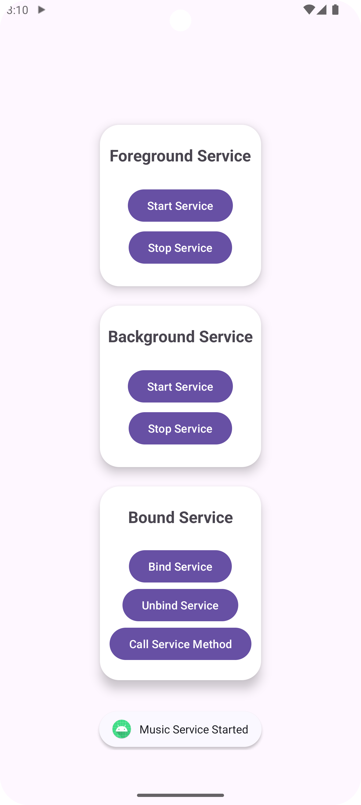
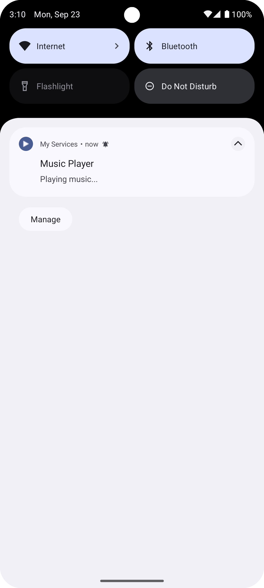

# Services in Android

<div style="display: flex; flex-direction: row; gap: 24px;">
    
    
    
</div>

This guide provides a step-by-step approach to create and use Foreground, Background and Bound Services. Follow these steps to learn and implement services for executing long-running background tasks.

## Introduction to Services

Services are components that run in the background to perform long-running tasks. They are used to execute operations that do not require user interaction. Services can be started or bound to an activity, and they continue to run even if the app is closed. They are used for tasks such as playing music, downloading files, or fetching data from a server.

### There are three types of services in Android:

- **Foreground Service**: These services run in the foreground and must display a notification to let the user know about ongoing tasks (e.g., music playback, file downloads). They have higher priority and are less likely to be killed by the system when resources are low.
- **Background Service**: These services run in the background and do not interact with the user. However, since Android 8.0 (Oreo), background services have stricter limitations to improve battery life and performance.
- **Bound Service**: These services are bound to an activity or other application components. They allow communication between the service and the component via a client-server interface. Bound services only run as long as the binding component is active.

### Key Methods of Service:
- **`onStartCommand()`**: Called when a service is started using `startService()`. It handles the request and specifies what should happen if the service is killed while executing (whether it should be recreated or not).
- **`onBind()`**: Used in bound services to handle requests made by components that are bound to the service. This method returns an `IBinder` interface for communication between the service and the client.
- **`onDestroy()`**: Called when a service is no longer used and is being destroyed. It is used to clean up any resources used by the service.


## Creating a Foreground Service

### Step 1: Create a Foreground Service Class

Create a new class that extends `Service` and overrides the necessary methods. For a foreground service, you need to display a notification to the user. Here's an example: [**`MusicService.kt`**](./app/src/main/java/com/example/myservices/services/MusicService.kt)

- Store all the constants required for the service in the companion object.
```kotlin
companion object {
    const val CHANNEL_ID = "music_channel"
    const val NOTIFICATION_ID = 1
}
```
- Since Android 8.0 (Oreo), you must create a notification channel for your notification. This is done in the `onCreate()` method of your service class.
- Create a pending intent for the notification action (e.g., go to the Main Activity of the app). This is done in the `onStartCommand()` method.
- Create a notification with the required parameters (title, content, icon, etc.) and start the service in the foreground using `startForeground()`.
- return `START_STICKY` from `onStartCommand()` to ensure the service is recreated if it is killed by the system.
- return `null` from `onBind()` since this is a foreground service and does not support binding.

### Step 2: Add the Service to the AndroidManifest.xml
- Add the service to the [**`AndroidManifest.xml`**](./app/src/main/AndroidManifest.xml) file and enable the required permissions.
```xml
<service
    android:name=".services.MusicService"
    android:enabled="true"
    android:exported="false"
    android:foregroundServiceType="mediaPlayback" />
```
**Permissions**:
```xml
<uses-permission android:name="android.permission.FOREGROUND_SERVICE" />
<uses-permission android:name="android.permission.FOREGROUND_SERVICE_MEDIA_PLAYBACK" />
<uses-permission android:name="android.permission.POST_NOTIFICATIONS" />
```

### Step 3: Start the Foreground Service

- If you are targeting Android 13 (Tiramisu) or higher, you need to request the `POST_NOTIFICATIONS` permission at runtime. This is done in the activity that starts the service. [**`MainAcitivity.kt`**](./app/src/main/java/com/example/myservices/MainActivity.kt)
- Start the service from an activity using `startService()` and pass the required data as an intent.
- You can stop the service using `stopService()`.


## Creating a Background Service

### Step 1: Create a Background Service Class

Create a new class that extends `Service` and overrides the necessary methods. For a background service, you do not need to display a notification. Here's an example: [**`BackgroundService.kt`**](./app/src/main/java/com/example/myservices/services/BackgroundService.kt)

Since Android 8.0 (Oreo), background services have limitations on running in the background. To overcome these limitations, you can use a `JobIntentService` or a `WorkManager`.

That being said, you can still create a background service by following these steps:

We will create a simple background service that logs a message every 5 seconds.

- Create a handler and a runnable to perform the background task.
- Start the runnable in the `onStartCommand()` method using the handler.
- Return `START_STICKY` from `onStartCommand()` to ensure the service is recreated if it is killed by the system.
- Return `null` from `onBind()` since this is a background service and does not support binding.
- Stop the service in the `onDestroy()` method and remove any callbacks.

### Step 2: Add the Service to the AndroidManifest.xml

- Add the service to the [**`AndroidManifest.xml`**](./app/src/main/AndroidManifest.xml) file.
```xml
<service
    android:name=".services.BackgroundService"
    android:enabled="true"
    android:exported="false" />
```

### Step 3: Start the Background Service

[**`MainAcitivity.kt`**](./app/src/main/java/com/example/myservices/MainActivity.kt)

- Start the service from an activity using `startService()` and pass the required data as an intent.
- You can stop the service using `stopService()`.


## Creating a Bound Service

### Step 1: Create a Bound Service Class

Create a new class that extends `Service` and overrides the necessary methods. For a bound service, you need to implement the `onBind()` method to return an `IBinder` interface for communication between the service and the client. Here's an example: [**`BoundService.kt`**](./app/src/main/java/com/example/myservices/services/BoundService.kt)

We will create a simple bound service that generates a random number.

- Create a binder object that extends `Binder` and returns the service instance for clinet communication.
- Create `MyBinder` class that extends `Binder` and returns the service instance.
- Override the `onBind()` method to return an instance of `MyBinder`.
- Override the `onUnbind()` method to handle the unbinding of the service.
- Implement a method in the service class that generates a random number. This method can be called by the client using the binder interface.

### Step 2: Add the Service to the AndroidManifest.xml

- Add the service to the [**`AndroidManifest.xml`**](./app/src/main/AndroidManifest.xml) file.
```xml
<service
    android:name=".services.BoundService"
    android:enabled="true"
    android:exported="false" />
```

### Step 3: Bind the Service to an Activity

[**`MainAcitivity.kt`**](./app/src/main/java/com/example/myservices/MainActivity.kt)

- Create a variable to store the bound service instance and a boolean to check if the service is bound.
- Implement the `ServiceConnection` interface to handle the connection and disconnection of the service and store the serviceConnection instance.
- Bind the service to the activity using `bindService()` and pass the serviceConnection instance.
- Unbind the service using `unbindService()`.

### AND ALL SET!!!

You have successfully integrated Foreground, Background, and Bound services into your Android application. These services ensure that your app remains functional, responsive, and user-friendly, even when performing long-running tasks in different contexts.