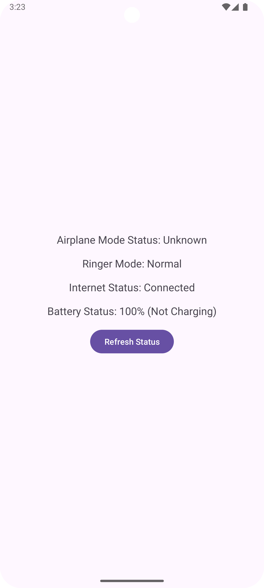

# Broadcast Receiver in Android



This guide is a step-by-step approach to register and handle broadcasts in Android. Follow these steps to learn and implement broadcast receivers for receiving and processing broadcast messages.

#### Note:

Android has been changing the way broadcasts are handled due to security and privacy concerns. Some broadcasts that were previously available are now deprecated or restricted. Make sure to use the latest APIs and follow best practices when working with broadcast receivers.

## Introduction to Broadcast Receivers

Broadcast Receivers are components that respond to broadcast messages from other applications or the system. They are used to listen for system-wide events, such as incoming calls, SMS messages, battery status changes, etc. Broadcast Receivers can be registered statically in the manifest file or dynamically in code.

- We have used Airplane mode state, Ringtone mode, and Battery status as examples to demonstrate the working of Broadcast Receivers.
- We have also used internet connectivity status which is `ConnectivityManager.NetworkCallback` which is a newer API introduced in Android Lollipop(API 21).

### Key points about BroadcastRecievers

1. **Static and Dynamic Registration:**
    - **Static:** You can declare a receiver in the `AndroidManifest.xml` file. It will be triggered even if your app is not running.
	- **Dynamic:** You can register the receiver in your code (usually in an Activity or Service), and the receiver will be active only while the app is running.

2. **Handling Broadcasts:**

When a BroadcastReceiver receives a broadcast, it executes its `onReceive()` method, which contains the logic to handle the broadcasted event.

3. **Types of Broadcasts:**
	- **System Broadcasts:** These are sent by the Android system, such as:
	    - **`ACTION_BOOT_COMPLETED`:** Sent after the system has finished booting.
	    - **`ACTION_BATTERY_LOW`:** Sent when the battery is running low.
	    - **`CONNECTIVITY_CHANGE`:** Sent when network connectivity changes.
	- **`Custom Broadcasts`:** These are sent by applications using `sendBroadcast()`, `sendOrderedBroadcast()`, or `LocalBroadcastManager`.

4. **Ordered vs Normal Broadcasts:**
	- **Normal Broadcast:** All receivers receive the broadcast at the same time.
	- **Ordered Broadcast:** Receivers handle the broadcast one at a time, and the result can be passed from one receiver to another.

**Exmaple of Simple Broadcast Reciever:**
```kotlin
class MyBroadcastReceiver : BroadcastReceiver() {
    override fun onReceive(context: Context?, intent: Intent?) {
        // Handle the broadcast here
        if (intent?.action == Intent.ACTION_BATTERY_LOW) {
            // Code to handle low battery
        }
    }
}
```
**Registering in Manifest:**
```xml
<receiver android:name=".MyBroadcastReceiver">
    <intent-filter>
        <action android:name="android.intent.action.BATTERY_LOW" />
    </intent-filter>
</receiver>
```

## Creating a Broadcast Receiver

### Step 1: Create a Broadcast Receiver Class

Create a new class that extends `BroadcastReceiver` and overrides the `onReceive()` method. This method is called when the receiver receives a broadcast message. Here's an example: [**`ModeChangeReceiver.kt`**](./app/src/main/java/com/example/mybroadcastreceiver/ModeChangeReceiver.kt)

- Implement the `onReceive()` method to handle the broadcast message. You can check the action of the intent to determine the type of broadcast received.
- You can perform different actions based on the broadcast message received.
- You can also display a toast message or update the UI based on the broadcast event.

### Step 2: Register the Broadcast Receiver

#### Static Registration:

- Add the receiver to the [**`AndroidManifest.xml`**](./app/src/main/AndroidManifest.xml) file, inside `<application>` tag.
```xml
<receiver
    android:name=".ModeChangeReceiver"
    android:enabled="true"
    android:exported="true">
    <intent-filter>
        <action android:name="android.media.RINGER_MODE_CHANGED" />
        <action android:name="android.intent.action.AIRPLANE_MODE" />
        <action android:name="android.intent.action.BATTERY_CHANGED" />
    </intent-filter>
</receiver>
```
We have not used static registration in this example. We have used dynamic registration in the activity.

#### Dynamic Registration:

- Register the receiver in your activity or service using `registerReceiver()` method.
```kotlin
val intentFilter = IntentFilter().apply {
    addAction(Intent.ACTION_AIRPLANE_MODE_CHANGED)
    addAction(AudioManager.RINGER_MODE_CHANGED_ACTION)
    addAction(Intent.ACTION_BATTERY_CHANGED)
}
registerReceiver(modeChangeReceiver, intentFilter)
```

you can also unregister the receiver in `onDestroy()` method of the activity.
```kotlin
override fun onDestroy() {
    super.onDestroy()
    unregisterReceiver(modeChangeReceiver)
}
```

#### Note:

The `Intent.ACTION_AIRPLANE_MODE_CHANGED` broadcast may not work as expected because, starting with Android 8.0 (API level 26), many implicit broadcasts—including `ACTION_AIRPLANE_MODE_CHANGED`—are no longer delivered to manifest-registered receivers due to power consumption optimizations. However, you can still use this broadcast for dynamic registration.

- **System setting changes don’t trigger broadcasts:**
	The user might be changing airplane mode from settings directly, but depending on how the change is triggered (via UI or programmatically), the broadcast might not be fired.

- **Check for airplane mode state manually:**
	If the broadcast is not being triggered as expected, you can manually check the airplane mode state using the `Settings.Global.AIRPLANE_MODE_ON` content provider

You can see the complete implementation in the [**`MainActivity.kt`**](./app/src/main/java/com/example/mybroadcastreceiver/MainActivity.kt) file.

#### Note:

- **Permissions:** Some broadcasts require specific permissions to receive them. For example, to receive `ACTION_BOOT_COMPLETED` broadcast, you need the `RECEIVE_BOOT_COMPLETED` permission and many more like `READ_PHONE_STATE`, `READ_SMS`, etc.

Make sure to add the required permissions in the manifest file.

### Step 3: Handle the Broadcast Message

- Implement the logic to handle the broadcast message in the `onReceive()` method of the receiver class.
- You can check the action of the intent to determine the type of broadcast received and perform the necessary actions accordingly.

You can see the complete implementation in the [**`ModeChangeReceiver.kt`**](./app/src/main/java/com/example/mybroadcastreceiver/ModeChangeReceiver.kt) file.

### Step 4: Perform Actions based on Broadcast

Based on the broadcast message received, you can perform different actions in your app. For example, you can display a toast message, update the UI, start a service, etc. We have used broadcast reciever to update the UI in this example.

You can see the complete implementation in the [**`MainActivity.kt`**](./app/src/main/java/com/example/mybroadcastreceiver/MainActivity.kt) file.

### Step 5: Use `ConnectivityManager.NetworkCallback` for Internet Connectivity

- We have also used `ConnectivityManager.NetworkCallback` to check the internet connectivity status in this example because the `CONNECTIVITY_CHANGE` broadcast is deprecated in Android 10 (API 29) and above.
- Earlier, we used `CONNECTIVITY_CHANGE` broadcast to check the internet connectivity status, but it is no longer recommended due to security and privacy concerns.
- `ConnectivityManager.NetworkCallback` is a newer API introduced in Android Lollipop (API 21) to monitor network connectivity changes.

#### Note:

- **Permissions:** To use `ConnectivityManager.NetworkCallback`, you need the `ACCESS_NETWORK_STATE` permission in the manifest file.
```xml
<uses-permission android:name="android.permission.ACCESS_NETWORK_STATE" />
```

- Remember to unregister the network callback in the `onDestroy()` method of the activity.
```kotlin
override fun onDestroy() {
    super.onDestroy()
    connectivityManager.unregisterNetworkCallback(networkCallback)
}
```

You can see the implementation in the [**`MainActivity.kt`**](./app/src/main/java/com/example/mybroadcastreceiver/MainActivity.kt) file.

### AND ALL SET!!!

You have successfully created a Broadcast Receiver in Android to receive and handle broadcast messages. You can now register the receiver, handle different types of broadcasts, and perform actions based on the received messages.