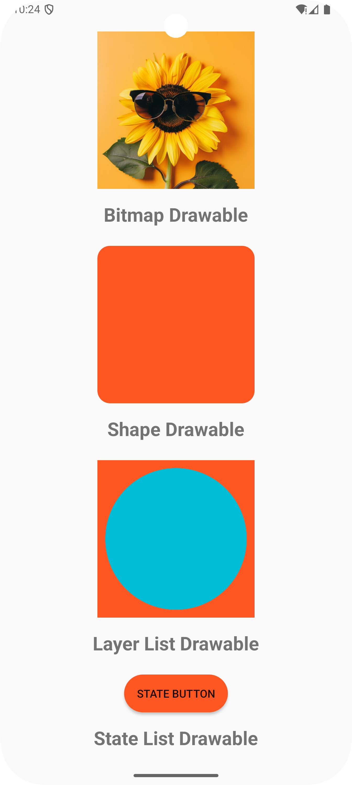
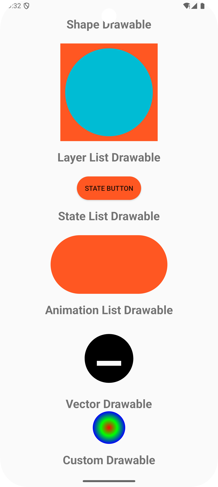

# Drawables and Custom Drawables in Android

<div style="display: flex; flex-direction: row; gap: 24px">
    
    
</div>

This guide provides an overview of drawable types, usage, and creating custom drawables in Android.
Follow these steps to understand the different drawable resources available in Android and how to
create custom drawables for your app.

## Introduction to Drawables

A drawable resource is a general concept for a graphic that can be drawn to the screen and that you
can retrieve with APIs such as `getDrawable(int)` or apply to another XML resource with attributes
such as `android:drawable` and `android:icon`.

### Types of Drawables

- **Bitmap Drawables**: These are images stored as bitmap files (PNG, JPEG, GIF, etc.) in your app's
  resources. They are commonly used for icons, images, and backgrounds.
- **Shape Drawables**: These are vector-based shapes defined using XML. They can be used to create
  simple geometric shapes, such as rectangles, circles, and lines.
- **Layer List Drawables**: These are drawable resources that contain multiple layers of other
  drawables. They can be used to create complex drawable objects by combining multiple drawables.
- **State List Drawables**: These are drawable resources that define different states for a view,
  such as pressed, focused, or disabled. They can be used to change the appearance of a view based
  on its state.
- **Animation List Drawables**: These are drawable resources that define frame-by-frame animations.
  They can be used to create simple animations, such as loading spinners or progress bars.
- **Vector Drawables**: These are vector-based images defined using XML. They are
  resolution-independent and can be scaled without losing quality. Vector drawables are recommended
  for icons and other UI elements that need to be scaled to different screen sizes.

## Using Drawables in Android

- **Backgrounds**: Set a drawable as the background of a view using the `android:background`
  attribute.
- **Icons**: Set a drawable as the icon of an `ImageView` or `ImageButton` using the `android:src`
  attribute.
- **Custom Views**: Create custom drawables for custom views by extending the `Drawable` class and
  implementing the `draw()` method.
- **State Changes**: Use state list drawables to change the appearance of a view based on its
  state (pressed, focused, etc.).
- **Animations**: Use animation drawables to create simple frame-by-frame animations for loading
  spinners, progress bars, etc.
- **Vector Images**: Use vector drawables for resolution-independent images that can be scaled to
  different screen sizes without losing quality.

## Creating Custom Drawables

You can create custom drawables by extending the Drawable class and overriding its methods (e.g.,
`draw()`, `setAlpha()`, `setColorFilter()`, and `getOpacity()`). This allows you to implement your
own drawing logic.

Here's an example of a custom drawable that draws a simple shape:

```kotlin
class CustomDrawable : Drawable() {
    override fun draw(canvas: Canvas) {
        // Draw your custom shape here
    }

    override fun setAlpha(alpha: Int) {
        // Set the alpha value of the drawable
    }

    override fun setColorFilter(colorFilter: ColorFilter?) {
        // Apply a color filter to the drawable
    }

    override fun getOpacity(): Int {
        // Return the opacity of the drawable
    }
}
```

You can then use your custom drawable in your layout XML files or programmatically in your code.

## Using Drawables in Android

### Step 1: Add Drawables to Resources

- **Bitmap Drawables**: Place your bitmap images (PNG, JPEG, etc.) in the `res/drawable` directory
  of your app.
- **Vector Drawables**: Define your vector drawables in XML files in the `res/drawable` directory,
  or simpler, add vector images using **New > Vector Asset** in Android Studio.
- Add other drawable resources (shape, layer list, state list, animation) as XML files in the
  `res/drawable` directory.

Click to go to [**`drawable`**](./app/src/main/res/drawable) directory.

### Step 2: Use Drawables in Layouts

See the implementation of different drawable types in the [**`activity_main.xml`
**](./app/src/main/res/layout/activity_main.xml) file.

1. **Bitmap Drawables**: Display a bitmap drawable in an `ImageView`.
    - **resource**: Add bitmap.png to `res/drawable` folder.
    - **usage in** `activity_main.xml`:
    ```xml
    <ImageView
        android:layout_width="wrap_content"
        android:layout_height="wrap_content"
        android:src="@drawable/bitmap" />
    ```
    - **supports**: Bitmap images generally support variety of formats, commonly BPM(Bitmap), PNG,
      JPEG, GIF, WebP, HEIF, TIFF, etc.

2. **Shape Drawables**: Define a shape drawable in an XML file.
    - **resource**: `res/drawable/shape_drawable.xml`
    ```xml
    <shape xmlns:android="http://schemas.android.com/apk/res/android"
        android:shape="rectangle">
        <solid android:color="#FF5722" />
        <corners android:radius="8dp" />
        ... other properties
    </shape>
    ```
    - **usage in** `activity_main.xml`:
    ```xml
    <View
        android:layout_width="wrap_content"
        android:layout_height="wrap_content"
        android:background="@drawable/shape_drawable" />
    ```
    - **supports**: Shapes can be rectangles, ovals, lines, rings, etc., with properties like solid
      color, gradient, stroke, corner radius, padding, size, etc.

3. **Layer List Drawables**: Combine multiple drawables into a layer list.
    - **resource**: `res/drawable/layer_list_drawable.xml`
    ```xml
    <layer-list xmlns:android="http://schemas.android.com/apk/res/android">
        <item ... />
        <item ... />
    </layer-list>
    ```
    - **usage in** `activity_main.xml`:
    ```xml
    <View
        android:layout_width="wrap_content"
        android:layout_height="wrap_content"
        android:background="@drawable/layer_list_drawable" />
    ```
    - **supports**: Layer list drawables can contain multiple layers of other drawables, such as
      shapes, bitmaps, gradients, etc.

4. **State List Drawables**: Define different states for a view.
    - **resource**: `res/drawable/state_list_drawable.xml`
    ```xml
    <selector xmlns:android="http://schemas.android.com/apk/res/android">
        <item android:state_pressed="true" android:drawable="@drawable/pressed" />
        <item android:state_focused="true" android:drawable="@drawable/focused" />
        <item android:drawable="@drawable/default" />
    </selector>
    ```
    - **usage in** `activity_main.xml`:
    ```xml
    <Button
        android:layout_width="wrap_content"
        android:layout_height="wrap_content"
        android:background="@drawable/state_list_drawable" />
    ```
    - **supports**: State list drawables can change the appearance of a view based on its state (
      pressed, focused, disabled, etc.).

   #### Note:
   By default, Android Studio applies material themes to your app, which may override the background
   color of buttons and other views. To see the state list drawable changes, you may need to
   customize the theme.

   A simple solution is to change the parent theme of your app to
   `Theme.AppCompat.DayNight.NoActionBar` in the `res/values/themes.xml` file. [**`themes.xml`
   **](./app/src/main/res/values/themes.xml) and [**`themes.xml (night)`
   **](./app/src/main/res/values-night/themes.xml) files.
    ```xml
    <resources ...>
        <style name="Base.Theme.MyDrawables" parent="Theme.AppCompat.DayNight.NoActionBar">
        <!-- Customize your light theme here. -->
        <!-- <item name="colorPrimary">@color/my_light_primary</item> -->
        </style>
        ...
    </resources>
    ```

5. **Animation List Drawables**: Create frame-by-frame animations.
    - **resource**: `res/drawable/animation_list_drawable.xml`
    ```xml
    <animation-list xmlns:android="http://schemas.android.com/apk/res/android">
        <item android:drawable="@drawable/frame1" android:duration="100" />
        <item android:drawable="@drawable/frame2" android:duration="100" />
        ... other frames
    </animation-list>
    ```
    - **usage in** `activity_main.xml`:
    ```xml
    <ImageView
        android:id="@+id/animationImageView"
        android:layout_width="wrap_content"
        android:layout_height="wrap_content"
        android:src="@drawable/animation_list_drawable" />
    ```
    - **start animation in** `MainActivity.kt`:
    ```kotlin
    val animationImageView = findViewById<ImageView>(R.id.animationImageView)
    (animationImageView.drawable as AnimationDrawable).start()
    ```
    - **supports**: Animation list drawables can be used to create simple frame-by-frame animations,
      frames can be bitmaps, shapes and other drawables.

6. **Vector Drawables**: Use vector images for resolution-independent icons.
    - **resource**: `res/drawable/ic_vector.xml` or use **New > Vector Asset** in Android Studio.
    ```xml
    <vector xmlns:android="http://schemas.android.com/apk/res/android"
        android:width="24dp"
        android:height="24dp"
        android:viewportWidth="24.0"
        android:viewportHeight="24.0">
        <path
            android:fillColor="#FF000000"
            android:pathData="M12,2C6.48,2 2,6.48 2,12s4.48,10 10,10 10,-4.48 10,-10S17.52,2 12,2zM7,15v-2h10v2H7z" />
    </vector>
    ```
    - **usage in** `activity_main.xml`:
    ```xml
    <ImageView
        android:layout_width="wrap_content"
        android:layout_height="wrap_content"
        android:src="@drawable/ic_vector" />
    ```
    - **supports**: svg-like vector images, can be scaled to different screen sizes without losing
      quality.

## Using Custom Drawables in Android

1. **Create Custom Drawable Class**: Extend the `Drawable` class and override its methods. See the
   implementation here [**`CustomCircleDrawable.kt`
   **](./app/src/main/java/com/example/mydrawables/CustomCircleDrawable.kt)
    - **`draw()`**: Implement the drawing logic for your custom drawable. You can use the `Canvas`
      object to draw shapes, text, bitmaps, etc.
    - **`setAlpha()`**: Set the alpha value of the drawable. This method is called when the alpha
      value of the drawable is changed.
    - **`setColorFilter()`**: Apply a color filter to the drawable. This method is called when a
      color filter is set on the drawable.
    - **`getOpacity()`**: Return the opacity of the drawable. This method should return one of the
      `PixelFormat` constants (e.g., `PixelFormat.OPAQUE`, `PixelFormat.TRANSLUCENT`, `
      PixelFormat.TRANSPARENT).
    - **`getIntrinsicWidth()`** and **`getIntrinsicHeight()`**: Return the intrinsic width and
      height of the drawable. These methods are used by views to determine the size of the drawable.

2. **Create a view to display the custom drawable**: In you layout XML file, add a view (e.g.,
   `ImageView`) to display the custom drawable. See the implementation here [**`activity_main.xml`
   **](./app/src/main/res/layout/activity_main.xml)
    ```xml
    <ImageView
        android:id="@+id/customDrawableImageView"
        android:layout_width="wrap_content"
        android:layout_height="wrap_content" />
    ```

3. **Use the custom drawable in your activity**: In your activity, create an instance of your custom
   drawable class and set it as the drawable for the view. See the implementation here [*
   *`MainActivity.kt`**](./app/src/main/java/com/example/mydrawables/MainActivity.kt)
    ```kotlin
    val customCircleDrawable = CustomCircleDrawable()
    val customDrawableImageView = findViewById<ImageView>(R.id.customDrawableImageView)
    customDrawableImageView.setImageDrawable(customCircleDrawable)
    ```

## Conclusion

You can use the built-in drawable resources provided by Android to create backgrounds, icons,
animations, etc. However, for more complex or custom requirements, you can create your own custom
drawables by extending the `Drawable` class and implementing the necessary methods. In most of the
cases, we use the built-in drawables, but it's always good to know how to create custom drawables
when needed.

### AND ALL SET!!!

You have successfully learned about different drawable types, their usage, and how to create custom
drawables in Android. By using these drawable resources effectively, you can enhance the visual
appeal and user experience of your Android applications.