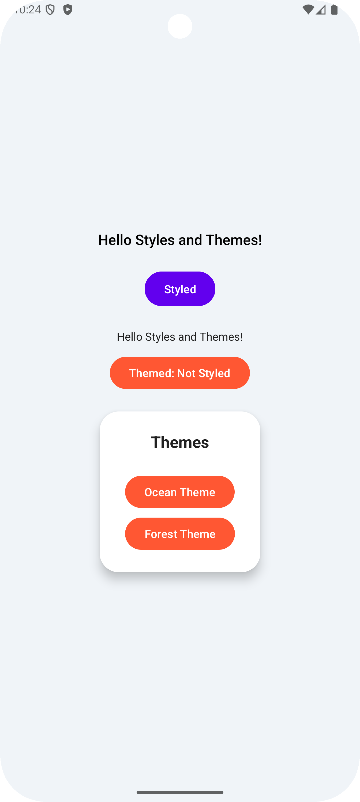
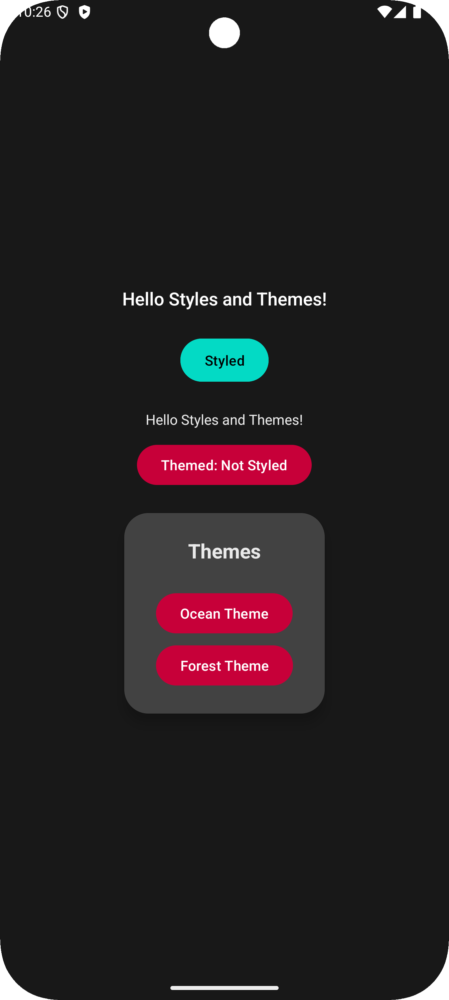
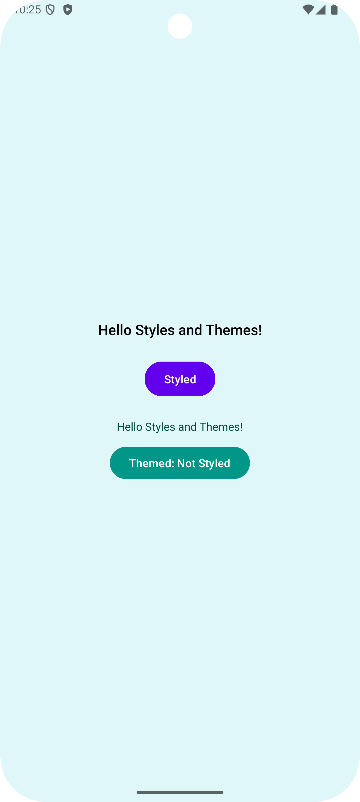

# Styles and Themes in Android

<div style="display: flex; gap: 24px;">
    
    
    
</div>

In this guide, we will explore the concept of styles and themes in Android app development. Follow
these steps to learn how to define and apply styles and themes to your app's UI elements.

## Introduction to Styles and Themes

Styles and Themes are core concepts in Android development used to define the look and feel of your
app. Here’s a breakdown of what they are and how they differ:

### Styles

A **Style** is a collection of properties that define the appearance of a single view (like a
button, text, image, etc.). Think of a style as a reusable set of attributes that can be applied to
a specific component.

#### Key Characteristics of Styles:

- **Purpose**: Define how individual UI elements look.
- **Scope**: Can be applied to a single view or a group of views.
- **Attributes**: Contains properties like text color, background color, text size, padding, etc.

#### Applying Styles:

```xml

<Button android:layout_width="wrap_content" android:layout_height="wrap_content"
    android:text="Click Me" style="@style/CustomButtonStyle" />
```

#### Summary:

- **Local to View**: Styles are applied directly to a view.
- **Reusability**: Can be reused across multiple views.

### Themes

A **Theme** is a broader concept that defines the overall appearance of the app or an entire
activity. While styles apply to individual views, themes are applied globally to activities or the
entire application, influencing all the UI elements within that scope.

#### Key Characteristics of Themes:

- **Purpose**: Define the overall look and feel of the app.
- **Scope**: Applied to the entire app or an activity.
- **Attributes**: Contains properties like color scheme, font styles, window background, etc.

#### Applying Themes:

```xml

<application android:theme="@style/MyAppTheme" <!-- Applied to the entire app -->
    ... ><activity android:name=".MainActivity" /></application>
```

#### Themes controll global attributes:

Themes define:

- **Primary/Secondary Colors**: Color scheme for the app.
- **Font Styles**: Default text appearance.
- **Widget Styles**: Default styles for buttons, text fields, etc.
- **Window Background**: Background color or drawable for the app.

#### Summary:

- **Global Scope**: Themes are applied to the entire app or an activity.
- **Consistency**: Ensures a consistent look and feel across the app.

## Differences Between Styles and Themes

Here are some key differences between styles and themes:

| Feature        | Styles                   | Themes                    |
|----------------|--------------------------|---------------------------|
| **Scope**      | Applied to a single view | Applied to the entire app |
| **Purpose**    | Define view appearance   | Define app appearance     |
| **Applied to** | Individual views         | Activities or the app     |
| **Examples**   | Button style, Text style | App color scheme, Font    |

## Using Styles

In recent versions of Android, instead of having `res/values/styles.xml`, the default project
structure uses `res/values/themes.xml`. This file holds theme-related configurations, including
styles.

While themes.xml is the default place for themes, you can create a separate styles.xml file if you
prefer to separate your styles from your themes.

- **Create a `styles.xml` file**: Inside the `res/values` directory, create a new XML file named
  `styles.xml`. See the implementation here [**`styles.xml`**](./app/src/main/res/values/styles.xml)
  and [**`styles.xml (night)`**](./app/src/main/res/values-night/styles.xml).
    - You can (optionally) define two styles files: `styles.xml` and `styles.xml (night)`.
    - First file will be used for the light theme, and the second file will be used for the dark
      theme.
    - The system will automatically switch between these files based on the current theme.
    - Right-click on the `res/values` directory, select `New -> Values resource file`, and name it
      `styles.xml`. It will create a new styles file for light theme.
    - Repeat the process to create `styles.xml` for the dark theme. This time name it `styles.xml`
      and set Directory name as `values-night`.
- **Define Styles**: Inside the `styles.xml` file, define your styles using the `<style>` tag.
    - Each style should have a unique name and contain the desired attributes.
    - You can define styles for different components like buttons, text views, etc.
    ```xml
    <style name="CustomButtonStyle">
        <item name="android:backgroundTint">@color/purple_500</item>
        <item name="android:textColor">@color/white</item>
        <item name="android:padding">12dp</item>
        ...
    </style>
    ```
    - **Note:**
      In recent versions of Android, the default used theme is
      `Theme.Material3.DayNight.NoActionBar`. This uses `android:backroudTint` instead of
      `android:background` for setting the background color of a button. If you are using an older
      version of Android, you can use `android:background` instead of `android:backgroundTint`.

- **Apply Styles**: To apply a style to a view, use the `style` attribute in the XML layout file.
  See the implementation here [**`activity_main.xml`
  **](./app/src/main/res/layout/activity_main.xml).
    - Reference the style using `@style/StyleName`.
    - For example, to apply the `CustomButtonStyle` to a button:
    ```xml
    <Button
        android:layout_width="wrap_content"
        android:layout_height="wrap_content"
        android:text="Click Me"
        style="@style/CustomButtonStyle" />
    ```
- **Use Styles in Themes**: You can also reference styles in themes to apply them globally. This is
  useful for defining default styles for various components.
    - Inside the `themes.xml` file, you can reference the styles using the `<item>` tag.
    - For example, to apply the `CustomButtonStyle` globally:
    ```xml
    <style name="MyAppTheme" parent="Theme.Material3.DayNight.NoActionBar">
        <item name="android:buttonStyle">@style/CustomButtonStyle</item>
    </style>
    ```

## Using Themes

Themes are defined in the `themes.xml` file, which is located in the `res/values` directory. This
file contains the configurations for the app's themes, including styles, colors, and other
attributes.

- **Define Themes**: Inside the `themes.xml` file, define your themes using the `<style>` tag. See
  the implementation here [**`themes.xml`**](./app/src/main/res/values/themes.xml) and [*
  *`themes.xml (night)`**](./app/src/main/res/values-night/themes.xml).
    - Each theme should have a unique name and contain the desired attributes.
    - You can define themes for the entire app or for specific activities.
    ```xml
    <style name="MyAppTheme" parent="Theme.Material3.DayNight.NoActionBar">
        <item name="android:colorPrimary">@color/purple_500</item>
        <item name="android:colorPrimaryDark">@color/purple_700</item>
        <item name="android:colorAccent">@color/teal_200</item>
        ...
    </style>
    ```
    - You can define multiple themes in your application

- **Apply Themes**: To apply a theme to the entire app or an activity, use the `android:theme`
  attribute in the AndroidManifest.xml file. See the implementation here [**`AndroidManifest.xml`
  **](./app/src/main/AndroidManifest.xml).
    ```xml
    <application
        android:theme="@style/MyAppTheme"
        ... >
        <activity android:name=".MainActivity" />
    </application>
    ```

### AND ALL SET!!!

You have successfully learned how to define and apply styles and themes in Android app development.
Use this knowledge to create visually appealing and consistent UI elements in your apps.