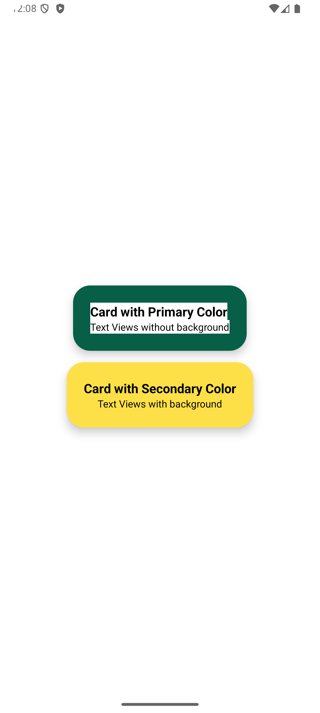
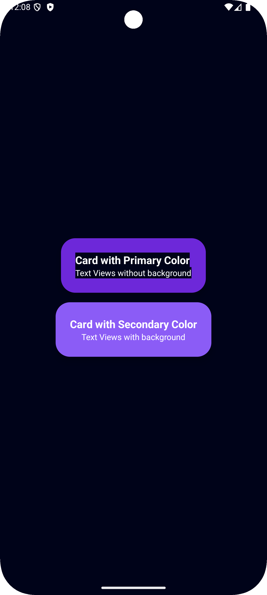

# Card View and Color Resources in Android

<div style="display: flex; gap: 24px;">
    
    
</div>

In this guide, we will explore how to manage color resources, color schemes, theming, and learn
about card views in Android app development. Follow these steps to understand how to create and
style card views and manage color resources effectively.

## Introduction to Card Views

A **Card View** is a UI component used to display content in a structured format. It provides a
consistent and visually appealing way to present information, similar to a physical card. Key
features of card views include:

- **Rounded Corners**: The `cardCornerRadius` attribute allows you to set the corner radius of the
  card.
- **Elevation (shadow)**: The `cardElevation` attribute adds a shadow effect to the card, making it
  appear elevated.
- **Padding and Margin**: The `contentPadding` attribute sets the padding inside the card. You can
  use `cardUseCompatPadding` to add padding for pre-Lollipop devices.
- **Background**: The `cardBackgroundColor` attribute sets the background color of the card.

**Note**: Default value of `cardElevation` is 2dp and `cardMaxElevation` is 2dp. So if you want to
change the elevation of the card, you need to change both values.

## Understanding Color Resources

Color resources in Android are defined in XML files located in the `res/values` directory. These
color resources can be used to maintain a consistent color scheme across your app and make it easier
to update colors in one place. Key points to remember about color resources:

- **Color Definition**: Colors are defined using hexadecimal values or predefined color names.
- **Resource File**: Colors are stored in XML files like `colors.xml` in the `res/values` directory.
- **Accessing Colors**: Colors can be accessed using `@color/colorName` syntax in XML or
  `ContextCompat.getColor(context, R.color.colorName)` in Java/Kotlin code.

To manage color resources effectively, Define a color palette with primary, secondary, accent, and
background colors to maintain consistency.

## Creating and Styling Card Views

### Step 1: Define a Card View in XML

To create a card view in your layout XML file, use the `<androidx.cardview.widget.CardView>` tag and
set the desired attributes like `cardCornerRadius`, `cardElevation`, `cardBackgroundColor`, etc. See
the implementation here [**`activity_main.xml`**](./app/src/main/res/layout/activity_main.xml).

```xml

<androidx.cardview.widget.CardView android:id="@+id/cardView" android:layout_width="match_parent"
    android:layout_height="wrap_content" app:cardCornerRadius="8dp" app:cardElevation="4dp"
    app:cardMaxElevation="6dp" app:cardUseCompatPadding="true" app:contentPadding="16dp">

    <!-- Add your content here -->

</androidx.cardview.widget.CardView>
```

### Step 2: Define Color Palette

To create a color palette, define color resources in the `colors.xml` file. Use the `<color>` tag to
define colors with a name and hexadecimal value.

You can also create a `colors.xml (night)` file for dark mode colors. The system will automatically
switch between the two based on the app's theme.

```xml

<resources>
    <color name="primary">#FF6200EE</color>
    ...
</resources>
```

Define colors in `colors.xml` and `colors.xml (night)` to support light and dark themes with same
name. You can apply different colors for different themes, but the name must be the same.

You can also apply use colors in themes. See the implementation here [**`themes.xml`
**](./app/src/main/res/values/themes.xml) and [**`themes.xml (night)`
**](./app/src/main/res/values-night/themes.xml).

### Step 3: Apply Theme to App

Ensure that you apply the theme to your app in the `AndroidManifest.xml` file. Use the
`android:theme` attribute to set the theme for your app.

```xml

<application...android:theme="@style/AppTheme">...</application>
```

### Step 4: Apply Colors to Card View

Use `cardBackgroundColor` attribute to set the background color of the card view. You can use color
resources defined in `colors.xml` to maintain a consistent color scheme.

- You can use `app:cardBackgroundColor="@color/primary"` to set the background color of the card
  view.
- You can also use `app:cardBackgroundColor="?attr/colorPrimary"` to set the background color of the
  card view based on the app's theme.
- You can also apply these colors to other UI elements like buttons, text views, etc.

### AND ALL SET!!!

You have successfully created and styled a card view in your Android app using color resources and
themes. You can now use this knowledge to design visually appealing UI components and maintain a
consistent color scheme across your app.