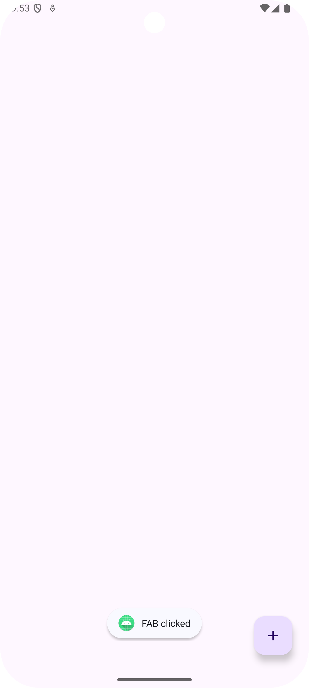

# Floating Action Button (FAB) in Android



In this guide, we will learn about Floating Action Button (FAB) in Android. Follow these steps to understand how to implement and customize the Floating Action Button in your app.

## Introduction to Floating Action Button

Floating Action Button (FAB) is a material design component that represents the primary action in an app. It is a circular button with an icon that floats above the content to promote the most common action in the app. Key features of FAB include:
- **Prominent Placement**: FAB is typically placed at the bottom right corner of the screen to make it easily accessible.
- **Primary Action**: It represents the main action in the app, such as adding a new item, composing a message, or sharing content.
- **Customization**: FAB can be customized with different colors, icons, animations, and behaviors to match the app's design.
- **Extended FAB**: An extended version of FAB can be used to display additional actions or options.

## Implementing Floating Action Button

Floating Action Button (FAB) is available as part of the Material Components Library. To use FAB in your app, you need to add the Material Components Library to your project and include the FAB in your layout XML file.

FAB works well with CoordinatorLayout, which allows it to respond to scrolling behaviors and other interactions. For example:
- The FAB can be hidden or shown based on the scroll direction of a RecyclerView.
- The FAB can be anchored to another view, such as a BottomAppBar or a Snackbar.
- The FAB moves up when the BottomAppBar is shown and moves down when the BottomAppBar is hidden, creating a seamless transition.
- The FAB can be customized with different shapes, sizes, and animations.

### Step 1: Add FAB to Layout XML

To add a Floating Action Button to your layout XML file, use the `<com.google.android.material.floatingactionbutton.FloatingActionButton>` tag and set the desired attributes like `android:layout_width`, `android:layout_height`, `app:srcCompat`, etc. See the implementation here [**`activity_main.xml`**](./app/src/main/res/layout/activity_main.xml).

```xml
<com.google.android.material.floatingactionbutton.FloatingActionButton
    android:id="@+id/fab"
    android:layout_width="wrap_content"
    android:layout_height="wrap_content"
    android:layout_gravity="bottom|end"
    android:layout_margin="16dp"
    app:srcCompat="@drawable/ic_add" />
```

### Step 2: Handle FAB Clicks

To handle clicks on the Floating Action Button, you can set an `OnClickListener` on the FAB and perform the desired action when the button is clicked. See the implementation here [**`MainActivity.kt`**](./app/src/main/java/com/example/myfloatingactionbutton/MainActivity.kt)

```kotlin
findViewById<FloatingActionButton>(R.id.fab).setOnClickListener {
    // Perform action when FAB is clicked
    Toast.makeText(this, "FAB Clicked", Toast.LENGTH_SHORT).show()
}
```

### Step 3: Customize FAB

You can customize the Floating Action Button by changing its color, icon, size, elevation, ripple effect, and other attributes.

You can also use the `ExtendedFloatingActionButton` to display additional actions or options in the FAB.

### AND ALL SET!!!

You have successfully implemented a Floating Action Button in your Android app. You can now customize the FAB to match your app's design and add the desired functionality to it.